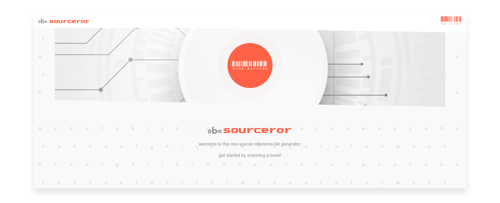
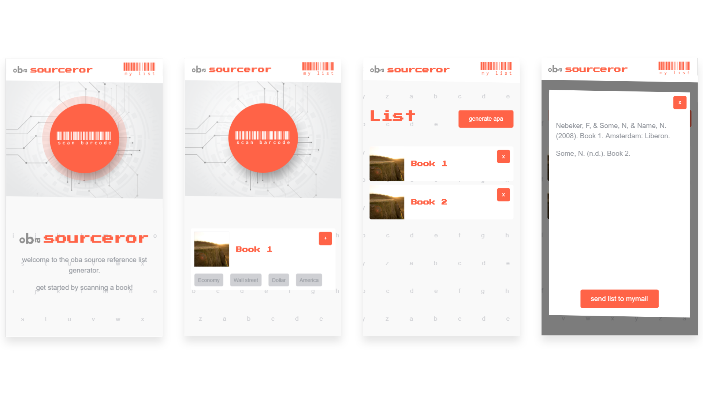

# OBA Sourceror



## Summary
A tool for students working on research papers or their thesis who want to easily generate a reference list (currently APA-style) from books within the [OBA](https://oba.nl).

## Table of contents
1. [Live demo](#1-Live-demo)
2. [Install](#2-Install)
3. [Features](#3-Features)
4. [API](#4-API)
5. [Design decisions](#5-Design-decisions)
6. [To-do](#6-To-do)

[Sources](#sources)     
[License](#License)

## 1. Live demo
Site performs best on mobile. Check the demo [here](https://follywolly.github.io/project-1-1819/src/#/).

## 2. Install
This project has no dependencies in and of itself, I added ngrok as a devdependency to pipe my localhost to a website that works on my phone for testing purposes.
```bash
## Just fork this project and in your terminal execute:
git clone https://github.com/YOUR-USERNAME/project-1-1819
```

## 3. Features


- Working ISBN book scanner
- Connection to the [OBA](https://oba.nl) api to fetch book data from ISBN numbers
- Adding scanned books to a personal list
- Removing scanned books from that personal list
- Generating a APA style reference list from your personal list and option to email this to an emailadress

## 4. API
This project uses the [OBA](https://oba.nl) api, which is a collection of books, dvd's, events and more affiliated with the Amsterdam Public Library. The endpoints used are public and can be used to fetch individual collection items or a collection of items corresponding to the search query.
The api itself returns XML data, which is being parsed into JSON by [maanlamp](https://github.com/maanlamp)'s so called [OBA Wrapper](https://github.com/maanlamp/OBA-wrapper).

## 5. Design decisions
t.b.a

## 6. To-do
- [ ] Add support for other reference formats, other than [APA style](https://www.apastyle.org/).
- [ ] Add other export options, other than sending to mail.
- [ ] Add support for scanning multiple books in a row without adding them (currently books need to be added if you want to 'save' them)

## Sources
- [OBA-wrapper](https://github.com/maanlamp/OBA-wrapper) by [maanlamp](https://github.com/maanlamp)
- [OBA Api](https://zoeken.oba.nl/?uilang=en)

## License
[MIT](LICENSE) @ [Folkert-Jan van der Pol](https://folkertjan.nl)
