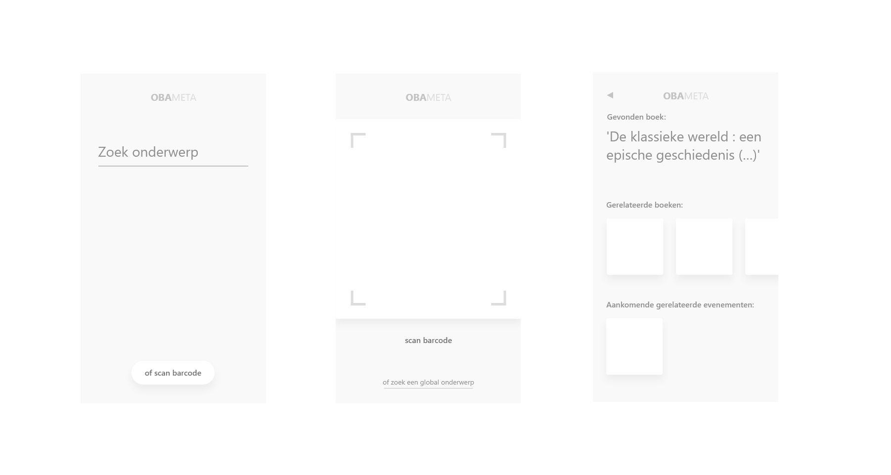

# OBA-Meta

## Summary
A tool for students working on research papers or their thesis and want to find related books to their subject or books they are already using within the [OBA](https://oba.nl).
Imagined scenario:
A student is working on a research paper about the ancient greeks. They have already found a book they are using for their paper, but they want more research to back it up. They browse to this mobile website, quickly scan the barcode on their already borrowed book and get recommended books, events and other sources about the subject of the book.
  

